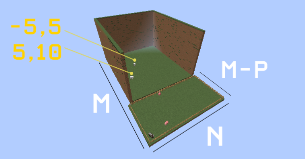
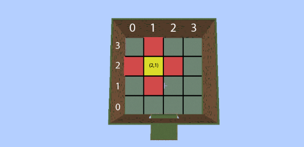
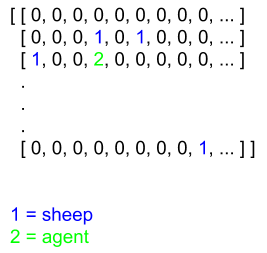
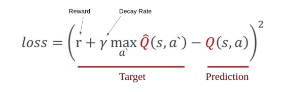

### Video

### Project Summary
The goal of this project is to use reinforcement learning methods to teach a Minecraft bot how to herd sheep. In particular, we chose to leverage tabular q-learning and deep q-learning to teach the agent how to efficiently gather a number of sheep in an arena and lead them to a designated pen on the outside of the arena. The reason for this is to bolster the difficulty of a trivial problem to one that requires methods and insights beyond that of a programmatic solution, much like a real world situation. More realistic situations could possibly include different kinds of terrain, time constraints; finishing before nightfall to avoid mobs, and larger distances. In the final phase of our project, we used a deterministic and discrete environment with sheep positions and map dimensions consistent. However, sheep behavior is technically dynamic for two reasons. They can be lured with wheat but can choose to ignore wheat. Sheep may also move around aimlessly and end up at different locations than where they were spawned.



### Approaches
The baseline approach to solving this sheep herding problem is a greedy traveling-salesman problem, in which the agent knows the location of each sheep and visits each sheep in the fewest possible steps before luring all of them into the pen. An advantage of this greedy approach is the time that can be saved without the need for testing or training, as we can simply precompute the shortest path to each sheep and carry out the specified action movements until we have herded all the sheep. This approach works with 100% accuracy and requires no data, since it works strictly with the environment provided. A disadvantage, however, is that this approach does not actively learn from its environment and can be quite hard to optimize, as it is NP complete.

#### First Approach: Tabular Q Learning
In the past half of the project, we tried to implement a tabular Q-learning algorithm to teach the agent how to herd sheep. Our approach was relatively flawed, however. The state space was far too small. We defined our states as a tuple of a few nominal measures up to a length of 3:

(*”Sheep are near”, *”Pen not reached”, ”No sheep herded”|“Some sheep herded”|”All sheep herded”)

We defined our action space as:

[“move forward”, “move backward”, “strafe left”, “strafe right”, “draw wheat”, “store wheat”]

While the rewards system and overall state/action space design was well-intentioned, it was far too broad for any significant learning to occur. Our agent could not meaningfully infer a link between state transitions, and not actually learn its task.

In the last half of the project, we redesigned the state and action space to use more stateful information; fractional coordinates. We divided the 60x60 block arena into a 4x4 grid. At each state the agent may transition to an available fractional coordinate, as seen in the picture below.



The state and action space are as follows:
States = {(x,z)}
Actions* = {“Move 1”, “Move -1”, “Strafe -1”, ”Strafe 1”,”pen”}

While this approach resulted in more consistent and reliable results, it did not produce the results we were looking for. After 1000 missions of training, it finished each mission an average of 25 seconds faster than our second approach. Unfortunately, it was never able to successfully herd any sheep. The reason for its speed was because it found the optimal path to enter the pen and conclude missions.

#### Second Approach: Deep Q Learning
Our formal proposed approach is to implement a deep q-learning algorithm, in which we use a neural network to approximate the rewards for each of our states. The advantage of this over tabular q learning is the simplified state space, which grows exponentially larger with more sheep that we add to the world. With deep q learning, we simply keep track of a world grid and update the sheep and agent locations as we learn, passing it in to our neural network to learn the pattern of success. 

Representation of world grid:



The pseudocode for our algorithm looks like the following:
```
initialize farm world
initialize agent
agent.build_model() # neural network 
while world is running:
  action = agent.act
  reward, state, game finished status = farm.update_state
  memory list <--  (previous state, action, reward, state, status into memory)
  get batch samples from memory to train from # we used batch sizes of 40
  model.fit(samples, target values)  # train from past experiences
  mse loss = model.evaluate()
```


For our neural network, we use the Keras library to build a model with 2 hidden layers and an input and output layer with state sizes corresponding to the size of our world grid and the size of our action space. We then compile and build the model setting MSE as our loss function and adding in an optimizer:

```python
def _build_model(self):
    # Neural Net for Deep-Q learning Model
    model = Sequential()
    # input layer using size of the world/farm
    model.add(Dense(self.state_size, input_shape=(self.state_size,)))
    # hidden layers
    model.add(PReLU())
    model.add(Dense(self.state_size))
    model.add(PReLU())
    model.add(Dense(self.state_size))
    model.add(PReLU())
    # output layer using size of the action space
    model.add(Dense(self.action_size))
    # build model
    model.compile(loss='mse', optimizer='adam')
    return model
```


We minimize our loss function based on the following formula used for q learning:



### Evaluation
For our evaluation setup, we quantified the success of our agent based on the average awards it earned during its training, the number of times it was successfully able to herd sheep into the pen, and its history of MSE loss. 

Awards were given based on distance calculated between the agent and each sheep and the distance between each sheep to the pen. Each of these calculated Euclidean distances were awarded as negative points for the agent, with the negativity decreasing as either the agent got closer to the sheep or the sheep got closer to the pen. We additionally gave out negative rewards for actions that led to an unchanging agent location. We awarded +100 for each sheep that our agent is able to stay near whilst herding, defined by us as 4 blocks euclidean distance-wise away, +200 if the agent reached the pen with sheep in tow, and +1000 for each sheep that successfully makes its way into the herding pen. 

The number of times our agent "wins" was also a clear evaluation criteria we imposed on our agent. We defined winning as sheep being herded into the pen, with the winning score proportional to the number of sheep in the pen. If the agent ended in the pen with no sheep to follow, the winning score is still a 0, counting as a loss.

For qualitative results, we looked at how intelligently our agent was able to factor in sheep distance compared to distance to pen. We also looked at how our agent was able to handle herding multiple sheep--whether it settled for a smaller reward of only bringing one sheep per mission, or if it tried to herd all the sheep in the world at once and herd them in together for a larger sum reward. Our agent opted for smaller rewards herding less sheep most of the time, most likely because we put a time constraint of 35s to finish each mission run. Overall, we saw this as a success in that the agent was still able to perform the baseline task of herding a sheep into a pen. 


### Refrences 
https://keon.io/deep-q-learning/?fbclid=IwAR0DftZDBhpV05C9wql3Yfu4GnI-T4G045xp3Q7lQhDDkvrkInenFRNKyRk
https://medium.com/@gtnjuvin/my-journey-into-deep-q-learning-with-keras-and-gym-3e779cc12762
https://www.learndatasci.com/tutorials/reinforcement-q-learning-scratch-python-openai-gym/?fbclid=IwAR3L9NSzKMn1NxB6P1LXjU69t9jsFoaVKsUxpJRSFPnN36doc1FJoa2A4hw


