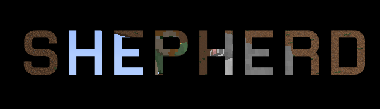
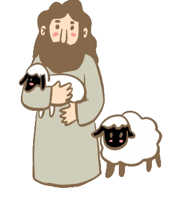

# Making a Minecraft Shepherd
The goal of this project is to leverage Machine Learning methods to teach a Minecraft avatar how to herd sheep

Source code: https://github.com/joycele/Shepherd

Reports:

- [Proposal](proposal.html)
- [Status](status.html)
- [Final](final.html)

