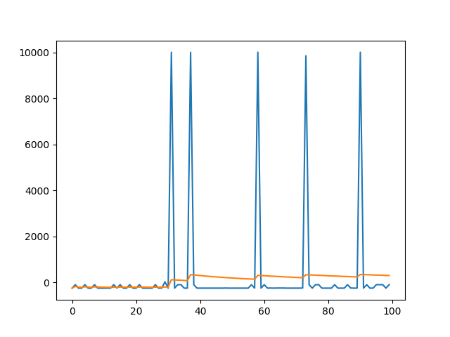

### Video

<iframe width="560" height="315" src="https://www.youtube.com/embed/NDbLGRo9zFM" frameborder="0" allow="accelerometer; autoplay; encrypted-media; gyroscope; picture-in-picture" allowfullscreen></iframe>

### Project Summary

The goal of this project is to create an shepherd AI which can lead sheep randomly spawned in the map to pen. For the current stage, we are building on a small and peaceful environment. Eventually the agent should be capable to dodge the trap, survive in the arena, and bring more sheep as possible as it can.

### Approach

For our project,  we decide to use tabular Q-learning method to train our Shepherd AI. We start working on our project from the assignment 2. We formalize our AL strategy as:

$$
Q(S_t, A_t)\leftarrow Q(S_t, A_t) + \alpha[R_{t+1} + \gamma\max_a Q(S_{t+1},a)- Q(s_t, A_t)]
$$

where $$\alpha$$ is the learning rate as we learn from the lecture. In a more intuitive way to implement our code, we have:


```
For each epoch:
	Initialize state S
	While the state is not end state or ecceed time limit:
		Choose A from S based on epsilon greedy policy from Q table
		Take action A, observe R, S_t+1
		update Q table and state S
```

For keeping the simplicity of the problem, we build a 60X60 small arena to hold only two sheep. The herding pen is next to the east side of the arena. We do not require the agent to do what players will do in real Minecraft environment like leading sheep into the yard and close the gate for now. The agent will only seeking sheep, luring them, and lead them out of the arena to the yard.

Our action space consists of move (east west north south), and whether to hold wheat in hand (by shifting inventory slot). There are  six actions in total. In the agent class we implement as following:

```python
self.possible_actions = {0: "move 0.5", 1: "move -0.5", 2: "strafe 0.5", 3: "strafe -0.5", 4: "hotbar.2 1", 5: "hotbar.1 1"}
```

Our observation space is a list of position including the agent and all sheep. Here is the code:

```python
if world_state.number_of_observations_since_last_state > 0:
    msg = world_state.observations[-1].text
    ob = json.loads(msg)
    for ent in ob["entities"]:
        if ent["name"] == "Jesus":
            self.prev_location = self.location
            self.location = (ent["x"], ent["z"])
        if ent["name"] == "Sheep":
            sheep_location.append((ent["x"], ent["z"]))
    self.sheep = sheep_location
    return (self.location, (ent["x"], ent["z"]))
```

We simply reward for the sheep herded and punish for not reaching the yard.

```python
rewards_ledger = {
    "sheep are near": 4,
    "some sheep herded": 25,
    "all sheep herded": 10000,
    "no sheep herded": -100,
    "pen not reached": -150
}
```

In each timestep, the q-table will be updated on the state, action, reward, and time. The code below show how it works:

```python
def update_q_table(self, tau, S, A, R, T): # got from assignment 2
        """Performs relevant updates for state tau.
        Args
            tau: <int>  state index to update
            S:   <dequqe>   states queue
            A:   <dequqe>   actions queue
            R:   <dequqe>   rewards queue
            T:   <int>      terminating state index
        """
        curr_s, curr_a, curr_r = S.popleft(), A.popleft(), R.popleft()
        G = sum([self.gamma ** i * R[i] for i in range(len(S))])
        if tau + self.n < T:
            G += self.gamma ** self.n * self.q_table[S[-1]][A[-1]]
            
        old_q = self.q_table[curr_s][curr_a]
        self.q_table[curr_s][curr_a] = old_q + self.alpha * (G - old_q)
```

The agent will follow a $$\epsilon$$-greedy policy to choose action from the q-table with the best q-value. The long-term reward will gradually degenerate as step goes: 

```python
    def choose_action(self,state,possible_actions):
        curr_state = self.get_q_state()
        if curr_state not in self.q_table:
            self.q_table[curr_state] = {}
        for action in possible_actions:
            if action not in self.q_table[curr_state]:
                self.q_table[curr_state][action] = 0

        action = ""
        if random.random() < self.epsilon: 
            action = possible_actions[random.randint(0, len(possible_actions)-1)]
        else: 
            temp_r_map = self.q_table[self.get_q_state()]
            actions_by_reward = defaultdict(list)
            sorted_acts = []
            for key, val in temp_r_map.items():
                actions_by_reward[val].append(key)
            for reward, acts_list in actions_by_reward.items():
                sorted_acts.append((reward, acts_list))
            sorted_acts.sort(key=lambda tup: tup[0], reverse=True)
            action = random.choice(sorted_acts[0][1])
        return action    
```
Through several test of runs, we foudn that setting the random action rate at 0.12 will help the agent figure out how to save the sheep faster.
It needs 50 runs for epsilon at 0.2 and only 30 runs for epsilon at 0.12.

```python
def __init__(self, alpha=0.3, gamma=1, n=1):
    """Constructing an RL agent.
    Args
        alpha:  <float>  learning rate      (default = 0.3)
        gamma:  <float>  value decay rate   (default = 1)
        n:      <int>    number of back steps to update (default = 1)
    """
    # q-learning variables
    self.epsilon = 0.12 # chance of taking a random action instead of the best
    self.q_table = {}
    self.n, self.alpha, self.gamma = n, alpha, gamma
```

### Evaluation


<br>
This is the first 100 session in one run. The blue line is the reward of each sesion. The orange line is the average reward, which is the total
rewared at the current sesoin divided by the number of seesions have run. The average reward increases as we train our model.Generally, the agent
improve its performance as time goes by. Although the agent's decision is not always stable, for now the agent has reach the goal of status report.

### Remaining Goals and Challenges

- **Expand the scale**

  Current stage is in a small scale. A large scale like 100X100 with 10 sheep could be our ultimate goal.

- **More randomness**

  We still need add more randomness in our arena. Some possible mechanisms like teleport point, and moving lava underground.

- **A simulation of Minecraft player**

  We hope we can build the shepherding pen in the middle of the arena with a gate. In this way, The agent should learn a more strategic way to shift hand items and keep sheep inside.

- **Algorithm improvement**

  Since the observation value of the environment is continuous, a 60X60 arena can create a great amount of data as we store all possible states in Q-table.  In the future, we will implement a deep reinforcement learning method with neural network to efficiently train the agent. 

### Resources Used

#### Libraries

- Malmo

   https://github.com/microsoft/malmo

#### Documentation

- Malmo Documentation

  http://microsoft.github.io/malmo/0.30.0/Documentation/index.html

  http://microsoft.github.io/malmo/0.30.0/Schemas/Mission.html

#### Other Resources

- CS175 Assignment 2

   https://canvas.eee.uci.edu/courses/20194/quizzes/69287